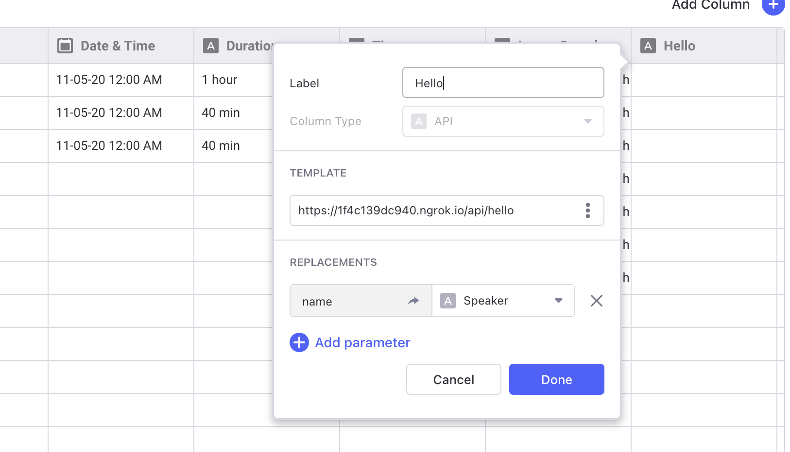

# Glide API Columns

[](https://vercel.com/new/git/external?repository-url=https%3A%2F%2Fgithub.com%2Fglideapps%2Fglide-api)

To add an API at `/api/hello`, create the file `api/hello.ts` with:

```ts
import * as glide from "./glide";

export default glide.api(async (params) => {
  const { name } = params;

  // Check that we got a name
  if (name === undefined) {
    return undefined;
  }

  return {
    type: "string",
    value: `Hello, ${name.value}!`,
  };
});
```

This defines a Glide API endpoint `https://<HOST>/api/hello` that takes a text value `name` and returns the text `Hello, {name}!`, which you would configure in Glide like:



## Deploy

Deploy on Vercel:

```shell
$ npx vercel
```
